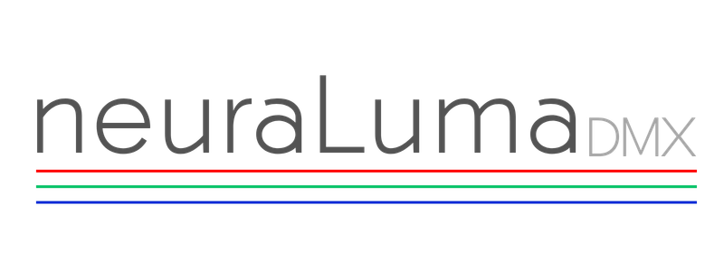
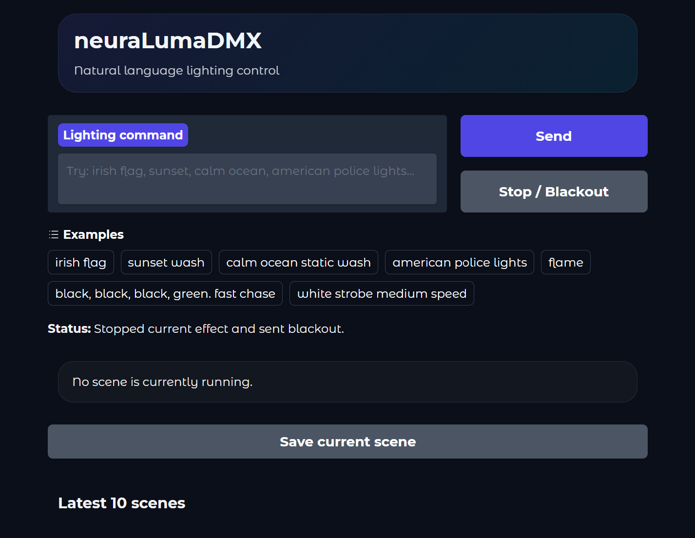
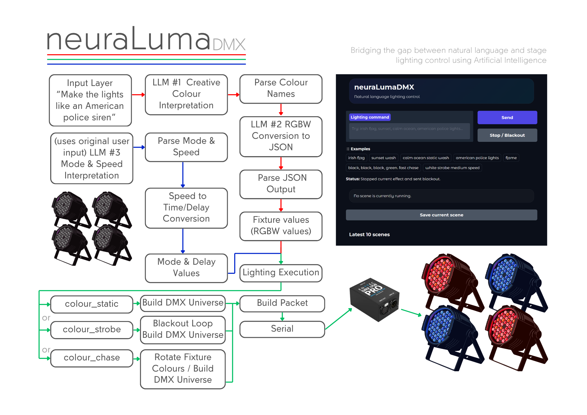

# neuraLumaDMX

AI-driven translation of natural language into real-time DMX lighting control.



---
## Overview

neuraLumaDMX bridges the gap between human intent and DMX512 lighting systems.

Instead of manually programming DMX values, users can input commands like:

> "irish flag"  
> "calm ocean"  
> "rave strobe"  

These are interpreted by a local LLM pipeline, converted into structured lighting data, validated, and sent to physical fixtures via a USB-DMX interface.



---
## Features 

- Natural Language -> Lighting Control
- Runs fully locally with local LLM (no internet connection required)
- Supports multiple input languages (depending on the LLM)
    - Tested using ``unsloth/Qwen3.5-9B-GGUF``
        - Gaeilge/Irish = **"gorm lonrach"** *(shiny blue)*
        - Spanish - **"Haz que las luces sean azules"** *(make the lights blue)*
        - Thai - **"ไล่ล่าสีเขียวเร็ว"** *(fast green chase)*
- Validation layer prevents invalid DMX output
- Supports 4 unique RGBW fixture outputs
  - An infinite number of RGBW fixtures can be controlled using 4 unique colour settings
- Real time DMX transmission over USB serial connection
- Multiple lighting modes:
  - Static / Strobe / Chase
- Multiple speeds:
  - Slow / Medium / Fast
- Gradio GUI
  - Command input
  - Scene history
  - Saved Scenes
  - Blackout control

---
## Pipeline 



---
## Tech Stack
- Python
- PySerial 
- llama.cpp with GGUF LLM *(local LLM inference)*
- DMX512
- USB-DMX *(Enttec Pro)*
- JSON 
- Gradio *(UI)*

---
## Running the Project

1. Start LLM Server

Any model exposing an OpenAI-compatible endpoint will work. In this project,
`llama.cpp` with `unsloth` gguf quant of `qwen3.5 9b` was used

Example (llama.cpp):

```
llama-server.exe \
  -hf unsloth/Qwen3.5-9B-GGUF \
  --host 127.0.0.1 \
  --port 8033
```

2. Install Dependencies

```
pip install gradio pyserial requests
```

4. Clone this repository:

```
git clone https://github.com/NigelByrne1/neuraLumaDMX
```

5. Clone this repository: (if required)

> LLM url can be replaced entirely, the port is kept separate for flexibility during development

```
# USB DMX / serial interface
interface_port = "COM3"
interface_baudrate = 57600

# llama.cpp (or compatible) OpenAI-style API
llm_port = "8033"
llm_url = "http://127.0.0.1:" + llm_port + "/v1/chat/completions"

# DMX start channel (1-based) for each of 4 RGBW fixtures — set fixtures to 4-channel RGBW mode
fixture_start_channels = [1, 5, 9, 13]
```

6. Run UI (from within repo)
```
python app.py
```

### Example Commands

> "irish flag"   
> "sunset wash"  
> "american police lights"  
> "calm ocean"   
> "white strobe fast"   

---
## How It Works

### 1. Colour Interpretation

**First LLM** translates user intent into 4 colour names:

``"irish flag"``
becomes ``"green, white, orange, green"``

### 2. RGBW Conversion
**Second LLM** converts colours into structured DMX values:
```
[
  {"r":0,   "g":255, "b":0,   "w":0},   
  {"r":0,   "g":0,   "b":0,   "w":255}, 
  {"r":255, "g":165, "b":0,   "w":0},   
  {"r":0,   "g":255, "b":0,   "w":0}   
]
```

Validated and parsed before use.

### 3. Mode & Speed Selection

**Third LLM** determines behaviour:
``"rave"`` becomes ``"chase, fast"``

---
## Limitations
- Single DMX universe (512 channels)
- Designed for RGBW fixtures only
- Depends on LLM output quality and consistency

## Future Improvements
- Speech to Text 
- Add more `modes`
  - Fade
  - Flicker
  - Pulse
- Explore beyond RGBW fixtures
  - Moving lights
  - Lights with macro settings
- Reduce hardware requirements
  - Smaller LLM or Cloud mode (will increase reliance on internet connection)
  - Increase number of pipelines and code complexity in order to decrease model size reliance
